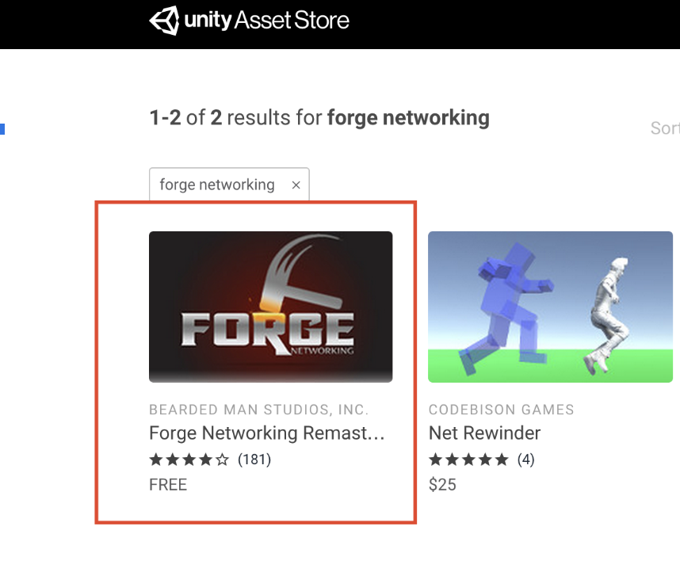
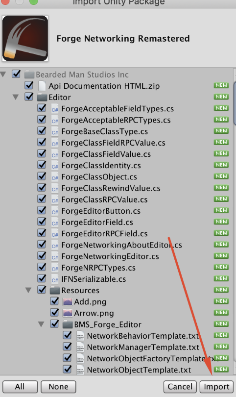
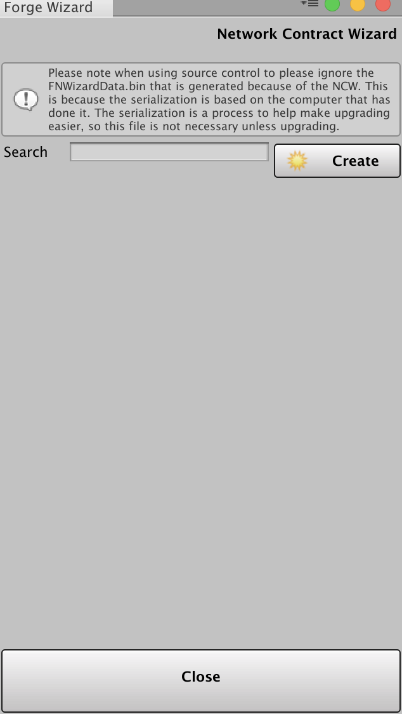
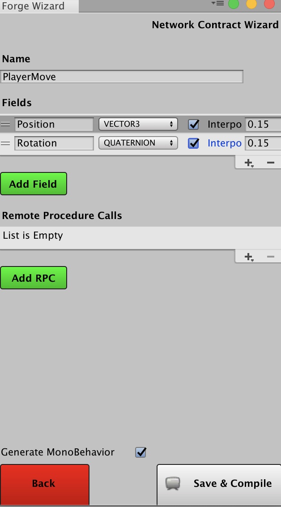

# Forge Networking Setup
In this guide we will take you through all the steps to install Forge and add multiplayer to our tank game.

## Step 1:
- Open the Unity Asset Store by pressing CTRL + 9 or CMD + 9;
- Type in: “Forge Networking”



- Download and install all the assets


## Step 2:
Open the “Network Contract Wizard” by going to *Window -> Forge Networking -> Network Contract Wizard* or bij pressing *CTRL + G or CMD + G*

## Step 3:
Click create to create a new *Network Contract*. This Network Contract is basically a set of rules in which the data will go over the network.



## Step 4:
Name the new contract **PlayerMove**. Add a field to the fields section and name it **position** which is of type **Vector3**.  

Hit the checkbox **Interpolation**, this tells Forge Networking that the position needs to smoothly transition between new updates. Leave the value as is.


Create a field for the rotation too, name it **rotation**, which is of type **Quaternion**.

Hit the checkbox **Interpolation**, this tells Forge Networking that the rotation needs to smoothly transition between new updates. Leave the value as is.  



## Step 5
Click **Save & Compile**, this will create quite a few scripts which you can use later in the code;

The main thing you will use is the **NetworkObject**. All the new values will be asigned to this object.

## Step 6:
Open the **PlayerTankController.cs**. We no longer need to derive from **MonoBehaviour.cs**. Change the class to **PlayerMoveBehavior**. This will 'inject' the networkObject to the **PlayerTankController** class with all the new information from all other connected clients.

The class **PlayerMoveBehavior** isn't in the default namespace, so we need to import it.

```csharp
using BeardedManStudios.Forge.Networking.Generated;
```

## Step 7:
Make sure that you send your own position and rotation over the network by adding the following methods.


```csharp
  void OtherPlayerMovement()
    {
        _rigidbody.MovePosition(networkObject.position);
    }

    void OtherPlayerRotation()
    {
        transform.rotation = networkObject.rotation;
    }
```

Change the update method:


```csharp
void Update()
    {
        if (!networkObject.IsOwner)
        {
            OtherPlayerMovement();
            OtherPlayerRotation();

            return;
        }
        else
        {
            Movement();
            Shooting();
        }

        if (_health <= 0)
        {
            Destroy(gameObject);
        }
    }
```

The networkObject.IsOwner basically checks if the networkObject is assigned to you. The reason for this check is that we only want to get the new positions of **other** players excluding yourself.


Change the Movement function to send your position over the network by adding the following line:

```csharp
        networkObject.position = transform.position + velocity;

        networkObject.rotation = rotation;
```

These methods are responsible for setting the other players positions and rotations in your scene.

## Step 9:
Open the NetworkManager prefab by navigating to Bearded Man Studios Inc -> Prefabs. Look for the Player Move Network Object section and change the size to 1. 
Add the playerTank prefab to the network manager.

## Step 10:
Create an empty game object in the Room scene and reset the transform. Create and add a new script to this object and name it GameLogic. 

Add the following code to the class:

```csharp
using UnityEngine;
using BeardedManStudios.Forge.Networking.Unity;
public class GameLogic : MonoBehaviour
{
    public int width = 20;
    public int depth = 20;

    private void Start()
    {
        Vector3 spawnPos = new Vector3(Random.Range(-(width / 2), width / 2), .25f, Random.Range(-(depth / 2), depth / 2));
        NetworkManager.Instance.InstantiatePlayerMove(0, spawnPos, Quaternion.identity);
    }
}
```
This code is responsible for instantiating the player over the network. So when another player joins, a new tank is spawned in a random position.

## Stap 11:
Open the **MultiplayerMenu** scene in the *BearderManStudiosFolder->Scenes*. To test with multiple players, press shift+ctrl+b or shift+cmd+b to open the build menu. First add the **MultiplayerMenu** scene and secondly add the **room** scene and press build.

## Stap 12:
Go back to your network wizard by pressing ctrl + g or cmd + g. Go to the PlayerMoveNetworkObject and add an RPC. Name it Shoot and leave the arguments empty. Click Save & Compile.

Back in your PlayerTankController.cs you will get an error saying that you need to override the method Shoot.

Add the following code to your PlayerTankController class.

```csharp
public override void Shoot(RpcArgs args)
    {
        // RPC calls are not made from the main thread for performance, since we
        // are interacting with Unity enginge objects, we will need to make sure
        // to run the logic on the main thread
        MainThreadManager.Run(() =>
        {
            var bullet = Instantiate(BulletPrefab, SpawnPoint.position, SpawnPoint.rotation);
        });
    }
```

Since we are working with RPC's we need to import the correct namespaces. Add the following to the top of the class:

```csharp
using BeardedManStudios.Forge.Networking;
using BeardedManStudios.Forge.Networking.Unity;
```

Go back to your networkManager prefab and change the size to 2. Add the bullet prefab to the manager.

Change the Shooting method to the following code:

```csharp
void Shooting()
    {
        if (Input.GetButtonDown("Fire1"))
        {
            networkObject.SendRpc(RPC_SHOOT, Receivers.All);
        }
    }
```

This tells all the other players to instantiate a bullet in their scene.

## Step 13:
Remember to build before testing.

Test & Play. You'll notice that the other player won't die. To fix this we'll create another RPC called Damage.

## Step 14:
Open your network wizard by pressing ctrl + g or cmd + g. Go to the PlayerMoveNetworkObject and add an RPC. Name it Damage and add an argument called damage of type INT. Click Save & Compile.

Back in your PlayerTankController class change the method AddDamage to the following code:

```csharp
public void AddDamage(int damage)
{
    networkObject.SendRpc(RPC_DAMAGE, Receivers.Target, damage);
}

```

This tells the server to send a message to take damage to the player that you hit.

Add the method Damage which looks like this:

```csharp
public override void Damage(RpcArgs args)
{
    // RPC calls are not made from the main thread for performance, since we
    // are interacting with Unity enginge objects, we will need to make sure
    // to run the logic on the main thread
    MainThreadManager.Run(() =>
    {
        _health -= args.GetNext<int>();
    });
}
```

args.GetNext<int>() is how you extract arguments from an rpc call.

## Step 15:
Play & test. You will notice that the other player still won't die. This is because we haven't told the server when a player needs to die.

## Step 16:
Open your network wizard by pressing ctrl + g or cmd + g. Go to the PlayerMoveNetworkObject and add an RPC.  Name it Die and leave the arguments empty. Click Save & Compile.

## Step 17:
Back in our PlayerTankController class change the update method to the following:

```csharp
void Update()
{
    if (!networkObject.IsOwner)
    {
        OtherPlayerMovement();
        OtherPlayerRotation();

        return;
    }
    else
    {
        Movement();
        Shooting();
    }

    if (_health <= 0)
    {
        Destroy(gameObject);
        networkObject.SendRpc(RPC_DIE, Receivers.All);
    }
}
```

When the health is 0 or below we need to tell everyone that we died. Add the RPC method die to the PlayerTankController class.

```csharp
public override void Die(RpcArgs args)
{
    networkObject.Destroy();
}
```

## Step 18
Play & test your game.  Remember to build. 

You should now be able to shoot and kill other players.